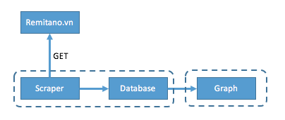

# myCrytoCoinChart

## To-do:
* [x] Parse data from remitano wesite
	* [x] Regex pattern

* [x] Database to store data
	* [x] postgres (psycopg2)

* [x] Display data
	* [x] Grafana (https://github.com/hiik3n/myPostgresGrafana)

## Implementation:

 

## Note:
* re pattern
	
		'''"vn"\s*:\s*(\{\s*"currency"\s*:\s*"VND"\s*,\
			\s*"btc_bid"\s*:([0-9]*[.])?[0-9]+\s*,\s*"btc_ask"\s*:([0-9]*[.])?[0-9]+\s*,\
			\s*"eth_bid"\s*:([0-9]*[.])?[0-9]+\s*,\s*"eth_ask"\s*:([0-9]*[.])?[0-9]+\s*,\
			\s*"usdt_bid"\s*:([0-9]*[.])?[0-9]+\s*,\s*"usdt_ask"\s*:([0-9]*[.])?[0-9]+\s*\})'''
* tmux 
	
		tmux
		crtl+b then d to leave/detach tmux
		crtl+b then $ to name session
		tmux attach -t session_name
		tmux list-session	to list all session
		tmux kill-session -t session_name
		tmux a attach last session

## Tutorial:
* Tutorial 1
	
